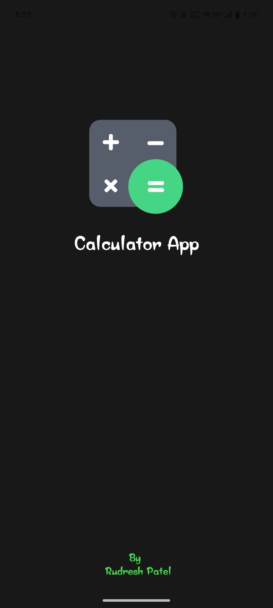
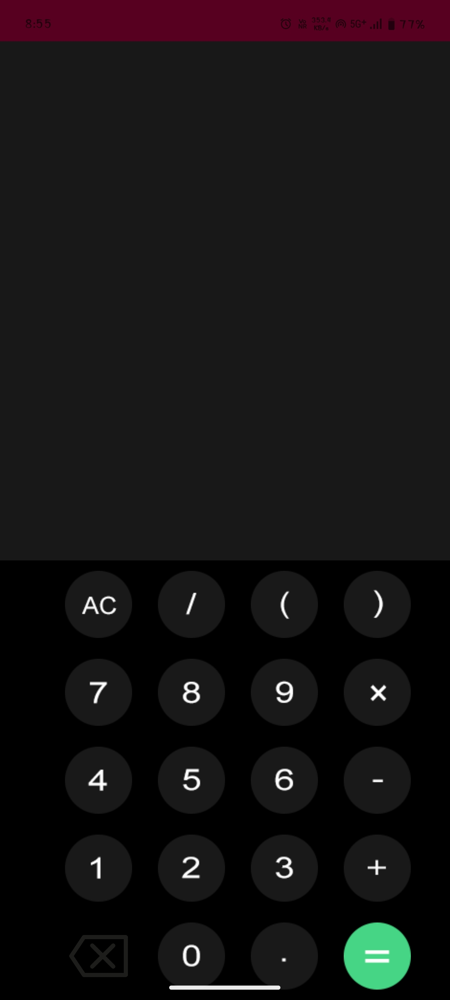

# 🧮 Simple Calculator App (Android - Kotlin)

A basic calculator Android app built using Kotlin. It supports fundamental arithmetic operations with proper input validation.

## 📱 Features

- Add, Subtract, Multiply, Divide
- Input validation (empty fields, divide by zero)
- Result display with formatted output
- ConstraintLayout-based responsive UI
- ViewBinding used for cleaner access to views

## 🛠 Tech Stack

- Language: Kotlin
- UI: XML + ConstraintLayout
- View Handling: ViewBinding
- Input Validation: Kotlin if-else
- IDE: Android Studio

## 🚫 Error Handling

- Prevents app crash on empty input
- Shows Toast if inputs are invalid
- Handles divide-by-zero gracefully
- Limits large inputs using `maxLength` in XML

## 📸 Screenshots

                

## 📌 How to Run

1. Clone or download this repo
2. Open in Android Studio
3. Run on emulator or physical Android device

## ✍️ Author

Rudresh Patel (rudreshpatel504@gmail.com)

